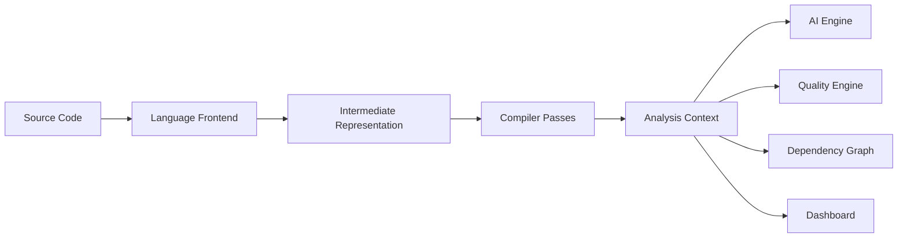
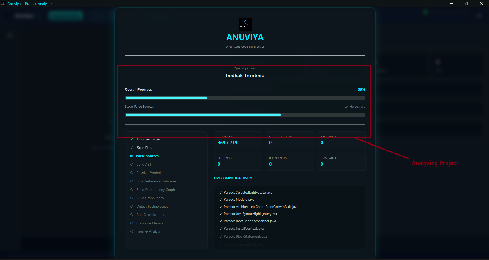
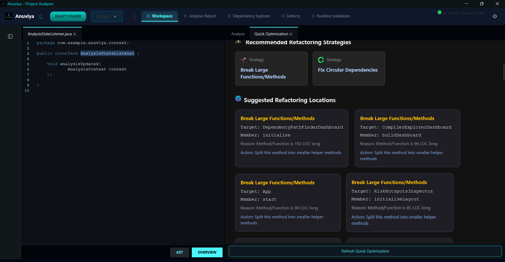
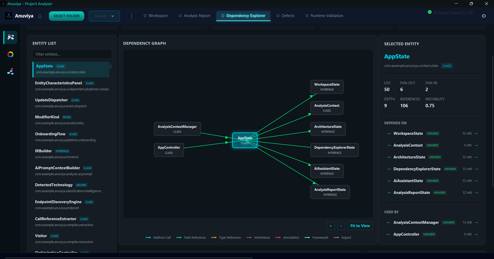
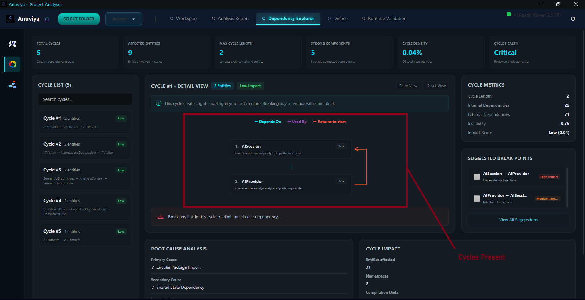

<div align="center">
  <h1>Anuviya</h1>
  <p><strong>Compiler-Driven Code Intelligence Platform</strong></p>
  <p>Understand, analyze, and improve codebases using compiler techniques and local AI</p>

  
  
  
  
</div>

## Introduction

Anuviya ("Anvya" a Sanskrit word meaning Connection) is an intelligent code analysis platform designed to help developers and architects understand complex codebases. By leveraging compiler techniques to build a rich intermediate representation (IR) of your code, it provides deep structural insights and metrics. Anuviya integrates with local AI models to offer intelligent, privacy-preserving analysis of architectural patterns, code quality, and potential improvements.

## ✨ Key Features

### 🔬 Compiler Pipeline
Anuviya uses a sophisticated compiler pipeline composed of 6 ordered passes: EntityBuilder, MetricBuilder, RelationshipBuilder, ProjectRootsBuilder, ProjectClassifier, and QualityAnalysis. This pipeline builds a rich, language-neutral Intermediate Representation (IR) using the visitor pattern.

### 🔌 Plugin Architecture
The platform features a multi-language plugin architecture centered around the `LanguageFrontend` interface. It currently supports Java (via JavaParser) and Python (via Tree-sitter), making it easy to extend to other languages.

### 🤖 AI-Powered Analysis
Integrates directly with local AI via Ollama (localhost:11434). Anuviya ensures privacy and security by sending verified compiler facts and structural insights to the AI engine, *not* your raw source code.

### 📊 Dependency Analysis
Explore your codebase with interactive dependency graphs. Features include real-time circular dependency detection and semantic indexing for navigating complex architectural relationships.

### 📈 Executive Dashboard
A high-level dashboard provides project health metrics, risk assessment, and a comprehensive architectural view, giving technical leaders the insights they need at a glance.

### 🏗️ Workspace Management
Robust workspace management includes session persistence, incremental analysis through efficient file watching, and a caching layer to accelerate repetitive tasks.

### 🧪 Runtime Validation
Ensures the robustness of your applications with automated endpoint discovery and integrated Gatling load testing capabilities.

### ⚡ Quality Engine
Automatically detects code hotspots, unused entities, and god classes. It calculates fan-in/fan-out metrics and provides actionable fix suggestions, including genetic algorithm-based optimization strategies.

## 🏛️ Architecture Overview



## 🚀 Quick Start

### Prerequisites
- JDK 24+
- Maven 3.8+
- Ollama (Optional, required for AI features)

### Installation
1. Clone the repository:
   ```bash
   git clone https://github.com/Abhi-4825/Anuviya.git
   cd Anuviya
   ```
2. Build the project:
   ```bash
   mvn clean install
   ```
3. Run the application:
   ```bash
   mvn javafx:run
   ```

## 📸 Screenshots
## 📸 Screenshots

<p align="center">
  
  
</p>

<p align="center">
  
  
</p>

<p align="center">
  
  
</p>

<p align="center">
  
  
</p>


## 🤔 Why Anuviya?

| Feature | Anuviya | SonarQube | IntelliJ IDEA | CodeClimate |
| :--- | :---: | :---: | :---: | :---: |
| **Offline-First / Local** | ✅ | ✅ | ✅ | ❌ |
| **Compiler-Based IR** | ✅ | ✅ | ✅ | ❌ |
| **AI Explanations** | ✅ (Local) | ❌ | ✅ (Cloud) | ❌ |
| **Plugin System** | ✅ | ✅ | ✅ | ✅ |
| **Desktop Application** | ✅ | ❌ | ✅ | ❌ |
| **Free & Open Source** | ✅ | ⚠️ (Limited) | ⚠️ (CE only) | ❌ |

## 📖 Documentation

| Document | Description |
| :--- | :--- |
| [README.md](./README.md) | Overview and quick start guide |
| [CONTRIBUTING.md](./CONTRIBUTING.md) | Guide for contributing to Anuviya |
| [CHANGELOG.md](./CHANGELOG.md) | Version history and release notes |
| [CODE_OF_CONDUCT.md](./CODE_OF_CONDUCT.md) | Community guidelines |
| [SECURITY.md](./SECURITY.md) | Security policies and reporting |
| [ROADMAP.md](./ROADMAP.md) | Future features and project direction |

## 🗺️ Roadmap

**Completed:**
- ✔ Compiler pipeline and IR design
- ✔ Java and Python frontends
- ✔ Interactive dependency graphs
- ✔ Local AI integration (Ollama)
- ✔ Executive dashboard

**In Progress:**
- 🚧 Real-time collaborative analysis
- 🚧 C++ language frontend
- 🚧 Advanced architectural refactoring suggestions
- 🚧 Cloud sync for enterprise teams
- 🚧 Plugin marketplace

## 🤝 Contributing

We welcome contributions! Please see our [Contributing Guide](./CONTRIBUTING.md) for more details on how to get started.

## 📄 License

This project is licensed under the MIT License - see the [LICENSE](./LICENSE) file for details.

---
<div align="center">
Built with ❤️ by <a href="https://github.com/Abhi-4825">Abhishek Raj</a>
</div>
